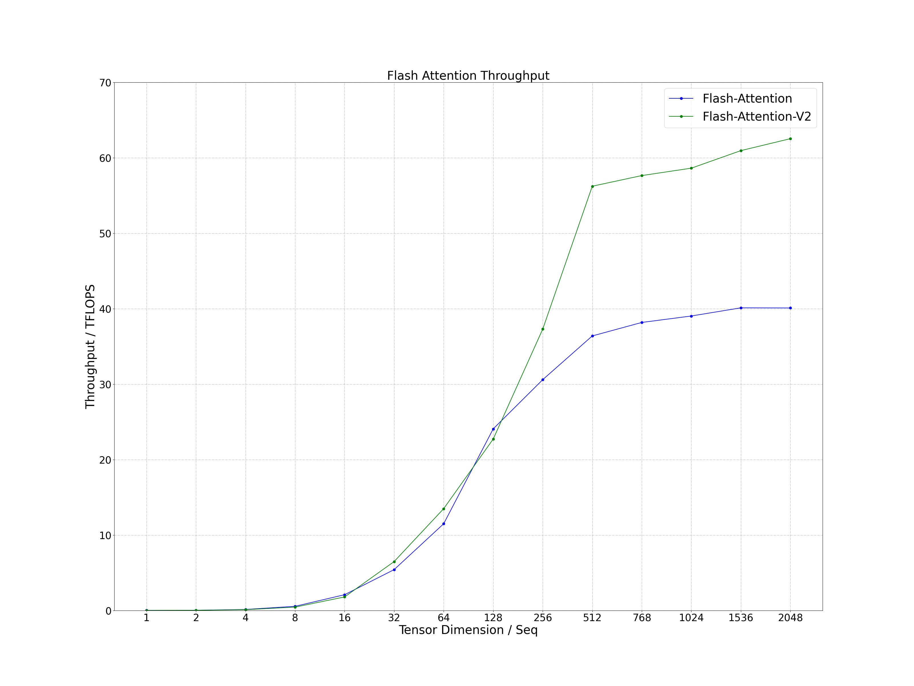
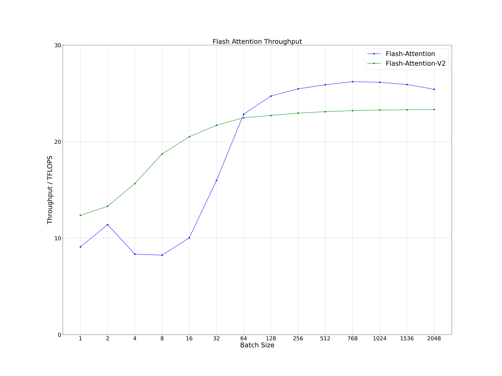
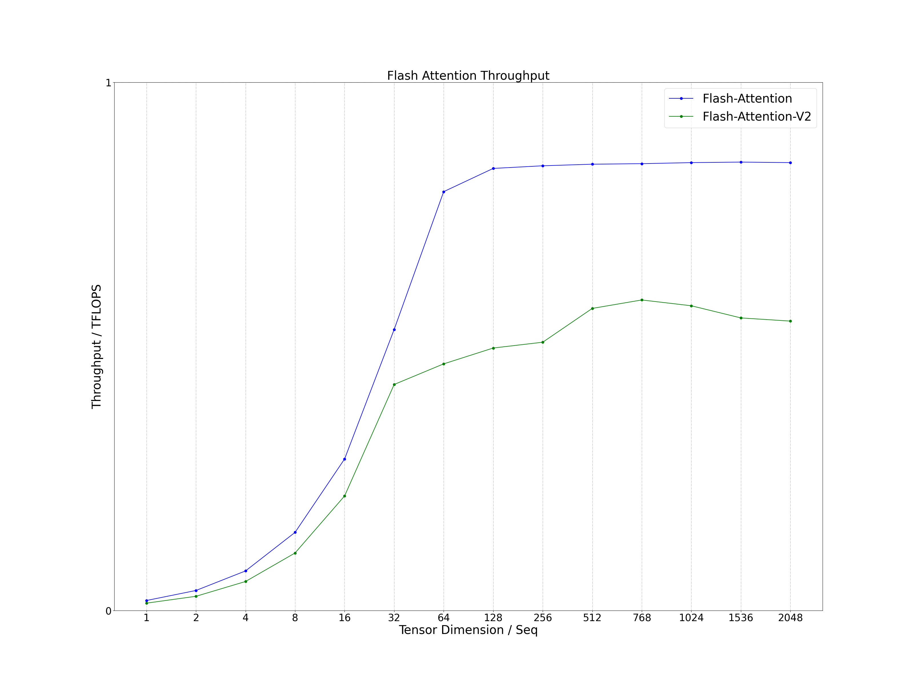
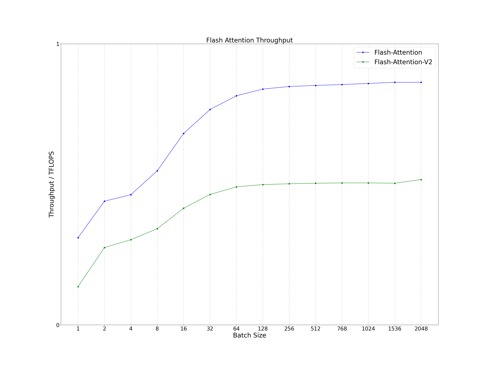

# Flash Attention Inference
Performance of the C++ interface of flash attention and flash attention v2 in large language model (LLM) inference scenarios. The calculation expression is as follows, where the precision of tensor Q, K, V and O is FP16. Remove redundant code from flash attention that has nothing to do with inference, such as backward, dropout and bf16 etc.
```
O = Softmax(Q * K^T) * V
```


# Compile
## Environment
- OS: Linux
- Cmake Version: >= 3.12
- GCC Version: >= 5
- CUDA Version: >= 11.4
- Gflags: install on ubuntu as follows
```
sudo apt-get install libgflags-dev
```

## Clone
```
git clone https://github.com/Bruce-Lee-LY/flash_attention_inference.git
```

## Build
### RTX3080Ti / RTX3090 / RTX A6000
```
cd flash_attention_inference
./build.sh -a 86 -t Release -b OFF
./build.sh -a 86 -t Debug -b OFF
```

### Tesla A100
```
cd flash_attention_inference
./build.sh -a 80 -t Release -b OFF
./build.sh -a 80 -t Debug -b OFF
```

# Run Sample
```
./run_sample.sh
```

# Performance
Process the data in the log and plot it as a line chart.

```
cd tools/performance
./performance.sh
```

## RTX3090
- CUDA Version: 11.8
- Head Num: 32
- Head Dim: 128

### Prompt
#### Seq
The performance of both is similar for short sequences and Flash Attention v2 performs well in long sequences. It can increase by about 50%.
- Batch Size: 128
- Seq Q: Seq
- Seq K: Seq



#### Batch
When the Batch is small, the Flash Attention v2 performance is better. When the Batch is large, the performance of the two kernels is comparable.
- Batch Size: Batch
- Seq Q: 128
- Seq K: 128



### Generator
#### Seq
The performance of both is similar for short sequences and Flash Attention performs well in long sequences.
- Batch Size: 128
- Seq Q: 1
- Seq K: Seq



#### Batch
The Flash Attention performance is better regardless of the size of the Batch.
- Batch Size: Batch
- Seq Q: 1
- Seq K: 128



# Reference
## flash-attention
https://github.com/Dao-AILab/flash-attention
- flash attention: v1.0.9
- flash attention v2: v2.1.0

## cutlass
https://github.com/NVIDIA/cutlass
- cutlass: v3.1.0

# TODO
- GQA/MQA Inference
- Hybrid Inference
- ALiBi Inference
